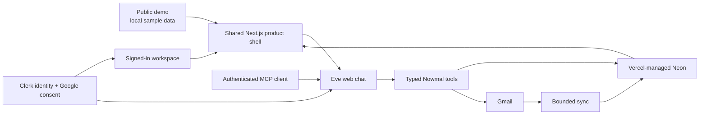

# Nowmal architecture

This is the handoff version of the architecture. Try the [public demo](https://nowmal.vercel.app/demo) first; the decisions below explain why the connected product behaves the way it does.

Nowmal is a focused work layer over Gmail. It keeps a bounded copy of recent mail, turns source-backed requests and commitments into work, and gives Eve narrow tools to explain or act on that work. It is deliberately not a second email client and not an autonomous mailbox agent.

## System shape

## Five decisions

### 1. The demo and connected app are one product

`/demo` and `/workspace` share the same product shell, language, and safety interactions. The public demo uses deterministic sample records and stores only reversible preferences on the device. The connected app loads only the signed-in person's server-side workspace.

This matters because the demo exercises the product rather than imitating it. It also creates a hard privacy rule: an empty or failed private workspace must look empty or failed. It must never be filled with sample mail.

### 2. Index mail first; analyze it only with permission

Gmail remains the source of truth. Nowmal stores a useful, bounded index in Neon so screens, search, and Eve do not need to rescan Gmail for every question.

The first refresh imports at most 300 threads from the last 30 days. Later refreshes use Gmail's history cursor to fetch only changed conversations. Search checks the full stored message text first; after an exact miss, it may import up to ten matching Gmail conversations. It never turns a search into an open-ended mailbox import.

Sync and analysis are different actions. Refreshing Gmail updates the index but does not call a model or change inferred work. The user confirms analysis separately, and each pass handles at most 100 pending threads. Filtering happens before that limit, so repeated confirmed passes move through the remaining index instead of reprocessing the same newest mail.

### 3. Inferred work must keep its evidence

Threads and messages are normalized once in Neon. Tasks are requests found in incoming mail; promises are commitments found in the user's sent mail. Both use one work-item model because their lifecycle is the same even though their direction is different.

Every accepted item stores an exact quote from a message in the same workspace. Stable dedupe keys merge repeated mentions of the same intent, while join tables preserve every contributing thread. User corrections are stored separately so a later model pass cannot silently undo a human decision.

The model proposes; the server decides what is valid. It checks confidence, message direction, workspace ownership, field bounds, and whether the quote actually exists in the cited message. Closing work is stricter: it needs newer evidence that explicitly fulfills or cancels the item. A reply or model omission is not enough.

### 4. “Now” has one definition

The connected app loads one bounded workspace snapshot rather than making a separate request for every screen and navigation badge. Independent database reads are batched, and the client derives views from that snapshot.

One pure queue function powers both the Now screen and the Now count. It combines unsent drafts with open tasks and promises, then orders them by urgency and due date. Opening an item takes the user to its canonical task or promise detail instead of creating a second place to edit it.

Trackers are also views over source-backed work. They appear only when at least two items form a repeated process across multiple threads or counterparties. A single conversation does not become a tracker just because a classifier found a keyword.

### 5. Eve and sending stay inside narrow permissions

Clerk supplies the user identity and brokers Google consent. Neon, provisioned through the Vercel project and accessed through Drizzle, stores queryable product state. Every private database operation includes the Clerk user ID as its workspace boundary.

Eve has typed Nowmal tools for tasks, evidence, search, sync, analysis, drafting, and sending. It does not receive a general shell, arbitrary web access, or an unchecked Gmail client. The browser and MCP expose the same agent and the same workspace rules. Browser conversations are durable, but a stored owner check prevents another account—or an unrelated MCP session—from taking over a web conversation.

Read access and send access are separate Google grants. Eve can prepare a draft without permission to send it. A real send requires all of the following:

1. the draft belongs to the current workspace;
2. its evidence and tone checks are cleared;
3. the call carries the draft's matching one-time key;
4. the user currently has Gmail send permission;
5. Eve pauses for fresh human approval; and
6. Nowmal reserves an audit record before calling Gmail.

If Gmail's response is ambiguous, the draft becomes `uncertain` and Nowmal will not retry automatically. The user checks Gmail Sent and reconciles it manually. Avoiding one duplicate email is more important than hiding that uncertainty.

## Who owns what

| Concern | Owner | Why |
| --- | --- | --- |
| User identity and Google consent | Clerk | One identity boundary for the app, Eve, and Gmail tokens. |
| Original email | Gmail | Gmail remains authoritative; Nowmal keeps only a bounded working index. |
| Threads, messages, work, evidence, drafts, and audits | Vercel-managed Neon | Durable, workspace-scoped state that screens and tools can query efficiently. |
| Agent sessions and tool orchestration | Eve | Durable conversation and human-in-the-loop tool calls without mixing chat state into mailbox state. |
| Product UI and server routes | Next.js on Vercel | One deployment contains the shared demo shell, authenticated app, APIs, Eve, and MCP endpoint. |

## Main flows

### Trying the demo

The browser loads the shared shell with a local sample adapter. No Clerk session, Neon connection, Gmail token, or live send path is available.

### Connecting and refreshing Gmail

Clerk authenticates the person and provides a Google token with read-only Gmail scope. A refresh normalizes bounded Gmail threads and messages into that person's Neon workspace. It does not run task analysis.

### Finding tasks and promises

After the user confirms the bounded model operation, analysis reads pending Neon records, proposes work and evidence, and passes those proposals through deterministic server validation before saving them. Changed threads become eligible for later re-analysis.

### Asking Eve

The browser resumes only the current user's current web-chat session. Eve answers through workspace-scoped tools rather than receiving the entire database or mailbox as prompt context. The MCP endpoint uses the same agent and constraints through OAuth/Vercel identity.

### Sending a reply

Eve creates or selects a stored draft. Nowmal resolves its checks, verifies the separate Gmail send scope, pauses the actual tool call for approval, and uses an idempotency key plus audit reservation to prevent a blind retry.

## Guarantees to preserve

- Private screens never substitute demo data.
- Every private query and agent session is tied to one Clerk workspace.
- Gmail refresh never silently starts model analysis.
- Inferred work always points to validated source mail.
- User corrections survive later analysis.
- The Now screen and Now count use the same selector.
- MCP does not bypass browser safety or workspace checks.
- No email is sent without separate scope, a cleared draft, and fresh approval.
- An uncertain Gmail send is never retried automatically.

## Current limits and intended next steps

- Gmail synchronization is currently user-triggered. Refreshes are incremental, but there is no Gmail watch subscription yet. The natural next step is Google Pub/Sub plus a durable Vercel workflow for bounded background refreshes.
- A confirmed analysis pass processes at most 100 pending threads. Large initial indexes may need several passes by design.
- Connected Trackers are currently conservative views derived from work items. The schema already has tracker tables, but user-named, editable tracker persistence is a later layer.
- The workspace snapshot intentionally limits rows returned to the UI. Counts and search use server-side queries rather than depending only on what is visible on screen.
- Search can extend the bounded index by at most ten exact Gmail matches after a local miss. Broader historical imports should remain an explicit maintenance action.

## Code map

- [`components/nowmal/`](../components/nowmal/) — shared product shell and connected/demo screens
- [`lib/gmail/`](../lib/gmail/) — Google token use, Gmail client, text normalization, and bounded sync
- [`lib/data/`](../lib/data/) — Drizzle schema and workspace-scoped repository queries
- [`lib/workspace/`](../lib/workspace/) — analysis contract, Now queue, workspace snapshot, and tracker derivation
- [`agent/`](../agent/) — Eve instructions, authentication, session ownership, channels, and typed tools
- [`app/api/`](../app/api/) — authenticated workspace, search, sync, analysis, and item routes

Deployment and account setup are documented separately in [External setup](./EXTERNAL-SETUP.md).
