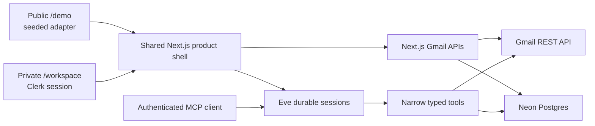

# Nowmal architecture

## Shape

The demo and connected product are not separate mockups. They share the shell, interactions, store contract, terminology, and safety model. The demo adapter supplies realistic deterministic records; the connected adapters supply Gmail/Neon records.

The private assistant panel uses Eve's `useEveAgent` client on the same origin. It streams durable
turns and renders approval requests in place, so the approval shown beside a proposed send is the
actual Eve input request—not a second client-only confirmation.

## Decisions

### Clerk over Neon Auth

Clerk is the smallest coherent choice here because the current Clerk SDK documents both Next.js resource protection and Eve tool authorization, and its backend can retrieve and refresh a user's Google provider token. That collapses identity and Gmail consent into one boundary. Neon remains data infrastructure rather than a second identity plane.

### Neon + Drizzle

The product needs cross-session, cross-agent, independently queryable state. Eve `defineState` is intentionally session-scoped, so durable inbox state belongs in Postgres. Drizzle keeps the schema executable and the checked-in SQL migration inspectable.

### One work-item table

Tasks and promises are symmetric reads of opposite mail directions. They share `work_items`; `kind` distinguishes them. This gives the hot workspace queries one index shape instead of two parallel systems:

- `(workspace_id, status, due_at)` for Now/Tasks;
- `(workspace_id, kind, status)` for Tasks versus Promises;
- unique `(workspace_id, dedupe_key)` for exactly one work item per inferred intent.

### Threads are stored once, relationships are joins

Gmail threads and messages are normalized. Tasks can cite several threads through `work_item_threads`, and clusters can contain a thread through `thread_clusters`. This avoids copying mail bodies into every feature and makes lineage cheap to explain.

### Evidence is first-class

`evidence_spans` links a short quote to the exact normalized Gmail message. A work item can be rebuilt without losing the source that justified it. `answer_check` refuses a source message outside the caller's workspace.

### Public demo without auth

`/demo` is a deliberate product mode, not an authentication exception on private APIs. It never receives Clerk or Gmail credentials and persists only device-local demo preferences. Private Gmail routes still check Clerk on the server.

## Gmail ingestion

The initial pull uses Gmail's search query `newer_than:30d`, stops after 100 thread IDs, and hydrates at concurrency 8. It stores one normalized thread and upserts messages by `(workspace_id, gmail_message_id)`.

Later pulls use the mailbox's Gmail `historyId` and request only `messageAdded` changes. An expired history cursor returns 404; the safe recovery is the same bounded 30-day rebuild. Search text is materialized once per thread and GIN-indexed, so search does not repeatedly concatenate messages.

The default manual pull hydrates at most 100 threads; the server also enforces an absolute 500-thread ceiling for explicit maintenance calls. This controls Gmail quota, data ingestion, and server duration. The next deployment step for large inboxes is to place user-approved continuation batches on Vercel Workflow and connect Gmail watch notifications through Google Pub/Sub.

## Task and grouping efficiency

- Dedupe is a unique domain key, not a UI heuristic.
- `work_item_threads` records every merged source so one task can explain why it exists once.
- Stash metadata lives as bounded JSONB on the work item; frequently filtered fields remain typed columns.
- Tracker stages are integer positions, making funnel counts a single `stage_index >= N` aggregation.
- Corrections are append-only events, separate from the current work-item status.
- Clusters, trackers, and their entries have stable per-workspace keys so renames do not change identity.
- Eve session IDs are stored separately from product records; agent conversation retention does not determine mailbox retention.

## Send correctness

`send_email` is intentionally stricter than an ordinary Gmail wrapper:

1. Eve can call only the typed tool; shell, filesystem, arbitrary fetch, web search, and recursive-agent tools are disabled.
2. `always()` creates a durable human approval before every execution.
3. The draft must be in `cleared` state with zero unresolved checks.
4. The draft's stored idempotency key must match the call.
5. An audit event reserves `(workspace_id, idempotency_key)` before Gmail is called.
6. Gmail receives a deterministic RFC 5322 `Message-ID` derived from that key.
7. Success stores the Gmail message ID. A repeated successful request returns `already_sent`.
8. Any ambiguous failure becomes `uncertain`; the tool refuses to retry until a person reconciles Gmail Sent and creates a new draft if necessary.

The separate Google scope is `https://www.googleapis.com/auth/gmail.send`; normal indexing uses `https://www.googleapis.com/auth/gmail.readonly`.

## Trust boundaries

- Browser → Next APIs: Clerk session, checked again beside each resource mutation.
- Browser → Eve HTTP channel: Clerk bearer/session verification; production fails closed without it.
- Same-project Vercel services/MCP → Eve: Vercel OIDC. User-scoped Gmail sends remain available
  only in an authenticated Clerk user session; a service identity cannot impersonate a mailbox owner.
- Eve → Gmail: user-scoped Clerk provider token with required-scope verification.
- Eve → Neon: server-only `DATABASE_URL`; every repository query includes `workspace_id`.
- Public demo: no path to Gmail, Neon, or real Eve sends.
